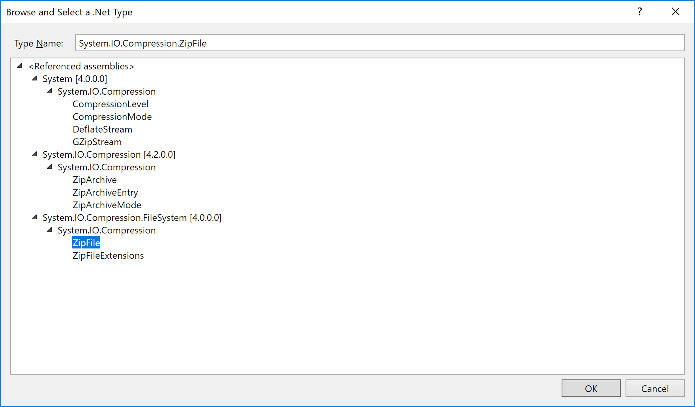
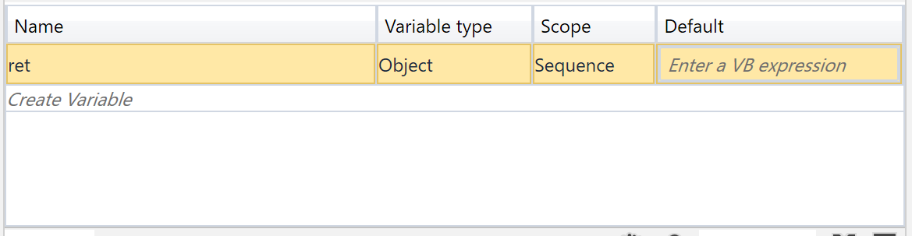

# 🔰UiPath Community editionでzipファイルを解凍する

UiPath CommunityEditionでZipファイルを解凍する方法について。
下記二種類の利用方法を解説する。

- .Net FrameworkのSystem.IO.Compression.FileSystemのZipFileクラスを利用
- UiPathのパッケージギャラリーに有志がアップロードした[BalaReva.Externals.Activities](https://gallery.uipath.com/packages/BalaReva.Externals.Activities/)を利用

## 🔰注意点

UiPath CommunityEditionのUiPath Studio 2018.3.0-beta.1ではSystem.IO.Compression.FileSystemのZipFileクラスを利用してzip圧縮ファイルを解凍する場合。
System.IO.Compression.FileSystemを読み込む手順に癖がありました。
インポートパネルから簡単に読み込まないので、Main.xamlファイルを直接修正して読み込んではいますが……
うまく読み込まえない現象が何に起因しているかは不明。バグ？

## 🔰利用するバージョン

- UiPath Studio 2018.3.0-beta.1
- Langage English

## 🔰.Net FrameworkのZipFileクラスを利用してZipファイルの解凍を行う場合

.Net Framework 4.5より追加されたZipFileクラスを利用する事によりzipファイルの解凍を行う。

[ZipFile クラス](https://msdn.microsoft.com/ja-jp/library/system.io.compression.zipfile(v=vs.110).aspx)

### 🔰zipファイルを解凍するサンプルプロジェクトの作成

まずは空のプロファイルを作成する。

Invoke Methodアクティビティを追加する。

TargetTypeのBrowser for Types...を選択

System.IO.Compression. とTypeNameに入力します。
今回利用したい、System.IO.Compression.ZipFileが表示されていません。

どうやらZipFileクラスを実装しているSystem.IO.Compression.FileSystemが読み込めていないようです。
インポートパネルよりSystem.IO.Compression.FileSysteと入力して見ますが反応がありません。

ただSystem.IO.Compressionは下記のようにインポートパネルより入力すると追加されます。

### 🔰xamlファイルに適当なエディタで開いて参照を追加

UiPathのフォーラムを検索してみると、Main.xamlファイルに直接参照を追加している例があるようなのでやってみます。
プロジェクトフォルダに作成された、Main.xamlを適当なエディタで開きます。

AssemblyReferenceという要素に、参照する名前空間が書いてありそうです。

今回利用したい、System.IO.Compression.FileSystemを先程追加したSystem.IO.Compressionの下に追加してみます。

`<AssemblyReference>System.IO.Compression.FileSystem</AssemblyReference>`

保存して、UiPath studioで再度作成したプロジェクトを開いて確認してみます。

System.IO.Compression.FileSystem.ZipFileが追加されました。
今回はこれを選択してOK。

### 🔰Invoke Methodを利用してZipFileクラスを操作する

今回、Zipファイルを解凍するのにZipFileクラスのExtractToDirectoryメソッドを利用する。
このメソッドは引数に,zipファイルの場所,zipファイルの解凍場所を渡して利用する。

MethodNameは今回利用するExtractToDirectoryを入力

引数の設定のためParametersをクリック

Direction | Type   | Value
--------- | ------ | ------------
In        | String | ".\test.zip"
In        | String | ".\"

この状態で実行すれば動きそうなものですが、自分の環境では下記のようなエラーが出てきてしまいました。

いろいろと試した所、invoke methodでresultを設定すると動くようになりました……というわけでresutlを設定していきます。

Resultで右クリック->Create Variableで変数を生成＆設定します。
今回は変数名retでセット。

resultに変数を設定するとエラーが出たので内容を確認します。

retの型がまずそう。

とりあえずretをobject型に変更します。

この状態で一度保存します。

### 🔰zipファイルを用意する

Direction | Type   | Value
--------- | ------ | ------------
In        | String | ".\test.zip"
In        | String | ".\"

先程パラメータに上記のパスを指定しました。
UiPathではプロジェクトファイルのパスから相対パスとなるため、プロジェクトファイルにtest.zipというファイルを作成。
プロジェクトファイル.\にファイルを解凍してみます。
（もちろん絶対パスも利用できます）

今回は、test.txtというファイルを圧縮したtest.zipというファイルを配置。

### 🔰プロジェクトを実行(ZipFile)

RUNから作成したプロジェクトを実行します。

ファイルが解凍できました。

## 🔰UiPathで有志が作成したパッケージ　BalaReva.Externals.Activitiesを利用してzipを解凍する

UiPathではパッケージギャラリーが用意されており、公式が作成した追加パッケージ。有志が作成した追加パッケージを簡単にダウンロードして追加できる仕組みが用意されている。

[UiPath Gallery](https://gallery.uipath.com/)

[BalaReva.Externals.Activities](https://gallery.uipath.com/packages/BalaReva.Externals.Activities/)

この有志が作成したパッケージにBalaReva.Externals.Activitiesというzipファイルを解凍するパッケージがあるため、ここではこれを利用してzipファイルの解凍を行う。

### 🔰プロジェクトの作成とパッケージのインストール

まず空のプロジェクトを作成し、Manage Packagesを選択します。

ALL Pacckageを選択し、BalaReva.Externals.Activitiesを検索してインストールボタンを選択。

OKを選択

### 🔰追加されたアクティビティ(UnZip)を利用する

パッケージのインストールが完了すると、アクティビティパネルにBalaRevaというメニューが追加されているので。

BalaReva->Externals->Others->UnZipを選択

UnZipアクティビティのプロパティを下記のように設定する。

プロパティ          | 値
------------------- | ------------
Extract Folder Path | ".\"
Zip File            | ".\test.zip"

### 🔰解凍するZipファイルを配置する

上記で".\test.zip"と相対パスでzipファイルを指定したため、
プロジェクトフォルダにtest.zipという適当なZipファイルを配置する。

今回は、test.txtというファイルを圧縮したtest.zipというファイルを配置。

### 🔰プロジェクトを実行(BalaReva)

RUNから作成したプロジェクトを実行します。

test.txtファイルが解凍されました。

## 🔰まとめ

Invoke Method + .Net FrameworkのZipFileクラスを利用してZipファイルを解凍する際はxamlファイルを直接修正する必要があるなど、トリッキーな手順が必要になってきそう。

今の所、下記の点が腑に落ちない。

- System.IO.Compression.FileSystemを簡単に読み込む方法はないのか？
- invoke methodでResultを指定しないとエラーが出る。

無理に.Netの機能を利用するよりは、UiPathギャラリーに有志がアップロードしたパッケージを利用するなり、コマンドラインから解凍ソフトを操作するなりするのが方法的に無難な気がします。
